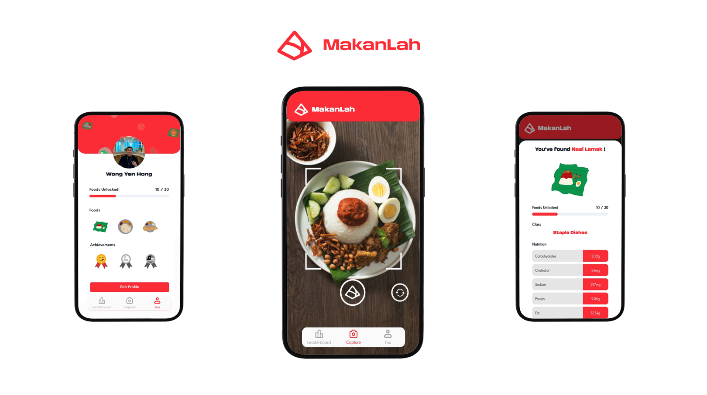
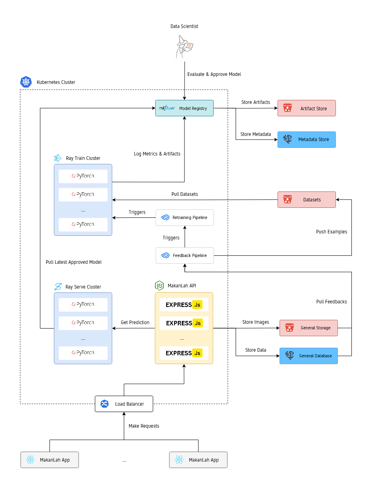
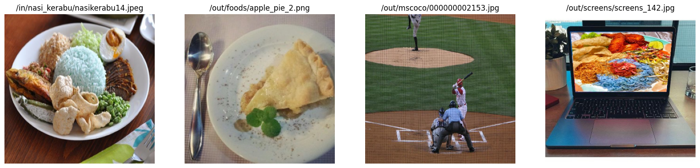

# MakanLah

    

[**MakanLah**](https://makan-lah.my) is a local food education app made for Malaysians! Think of it like Pokémon Go, but for food. Your goal is to "capture" as many local foods as you can while competing with others. MakanLah features a total of 30 foods, and for every food you "catch," it shares cool facts, including nutritional info and fun trivia!

The app runs on a machine learning model trained on a small dataset I collected myself. It's not perfect—sometimes it misidentifies foods, and yes, you could cheat by snapping pics from Google. But that’s where YOU come in! MakanLah has a model retraining pipeline that uses user feedback to improve over time. The more data we get, the smarter it becomes—meaning fewer mistakes down the road.

Try MakanLah now at: https://makan-lah.my

## Motivation

The main goal is to apply what I've been learning about MLOps (and ML in general). A secondary goal is to build an app that _can_ support users and have _somewhat_ of a real-world use case. I know that a lot of the things I've done in this project are probably overkill (and probably dumb), but it's all part of the proof-of-concept, and the main goal is to learn anyway, so why not? (My wallet is bleeding with every second this app is running on AWS.)

## Architecture

The MakanLah system is composed of several key components: the **MakanLah App, MakanLah API, Model Registry, Model Serving, Model Training, and Workflow Orchestration**. These components work together to power the system, as illustrated in the diagram below.

    

### 1. MakanLah App

The MakanLah App (https://makan-lah.my/) is our web application where users can snap pictures of food, view their profile (with a cool floating display of all the foods they've captured), and check out the leaderboard. (Fun fact: All the food images were hand-drawn!)

Built with [React.js](https://react.dev/) and [ChakraUI](https://chakra-ui.com/). To manage state across pages efficiently, we used [Redux](https://redux.js.org/), which keeps everything in sync and accessible where needed.

It was hosted on [Vercel](https://vercel.com/) because it's simple and awesome.

### 2. MakanLah API

The MakanLah API powers the backend, handling all user requests from the web app. Built with [Express.js](https://expressjs.com/) (using a clean, well-structured [template](https://github.com/hagopj13/node-express-boilerplate)), it stores user data in a PostgreSQL database on [Amazon RDS](https://aws.amazon.com/rds/). For food images, we store them in [Amazon S3](https://aws.amazon.com/s3/) buckets.

The API is containerized and hosted on [Amazon ECR](https://aws.amazon.com/ecr/) (Elastic Container Registry), then deployed to a [Kubernetes](https://kubernetes.io/) (K8s) cluster on [Amazon EKS](https://aws.amazon.com/eks/) (Elastic Kubernetes Service). To expose it, we used K8s Ingress, which routes traffic to the right pods.

### 3. Model Registry

We needed a way to track experiments and manage different versions of our food classification model, so we went with [MLflow](https://mlflow.org/). It's an open-source tool that's perfect for comparing model performance, visualizing training runs, and versioning models with ease. MLflow's model registry lets us store and retrieve model artifacts seamlessly.

We deployed it using a [community Helm chart](https://artifacthub.io/packages/helm/community-charts/mlflow), with an S3 bucket for artifacts and a PostgreSQL database for metadata.

### 4. Model Serving

For scalable, high-performance model serving, we chose [Ray Serve](https://docs.ray.io/en/latest/serve/index.html), a framework built on [Ray Core](https://docs.ray.io/en/latest/ray-core/walkthrough.html). It can handle request batching and auto-scaling effortlessly, making it ideal for production workloads.

Our serving app pulls the latest model from MLflow’s registry before spinning up. It runs on a Ray cluster, deployed via [KubeRay](https://github.com/ray-project/kuberay) (_a toolkit to run Ray applications on K8s_).

### 5. Model Training

To train our food classification model efficiently in a distributed manner, we used [Ray Train](https://docs.ray.io/en/latest/train/train.html) (another library built on top of [Ray Core](https://docs.ray.io/en/latest/ray-core/walkthrough.html)). It handles data-parallel training on PyTorch without us worrying about how to parallelize the workloads.

Like the serving component, training jobs run on a Ray cluster orchestrated by [KubeRay](https://github.com/ray-project/kuberay).

### 6. Workflow Orchestration

To manage reusable, fault-tolerant workflows, we picked [Metaflow](https://metaflow.org/), an open-source framework by Netflix designed for data scientists' productivity. It supports scalable execution, checkpointing, and more.

In MakanLah, we built two key flows:

- A feedback flow to process explicit user feedback and update datasets.
- A retraining flow to trigger new Ray Train jobs when needed.

We deployed these workflows on Argo Workflows, which is recommended by Metaflow as a production workflow orchestrator for K8s.

### Misc

To ensure the infrastructure is easily reproducible and disposable, we used [Terraform](https://www.terraform.io/) as our Infrastructure as Code (IaC) tool to manage it.

## Food Classification

### Dataset

For MakanLah, we needed to classify 30 different foods. We started by scraping about 150 images per food using a [Google Image Scraper](https://github.com/ohyicong/Google-Image-Scraper), then manually cleaned up the dataset by removing bad or irrelevant images. After cleaning, we ended up with around 70 quality images per food class - not perfect, but good enough to work with.

To make sure the model doesn't mistake things like a red-haired person for rambutan, we also included negative examples (out-of-distribution images). These come from sources like [Food-101](https://www.kaggle.com/datasets/kmader/food41) and [MSCOCO](https://cocodataset.org/#home), containing foods outside our 30 classes and random everyday images. We also wanted to prevent the model from recognizing food images shown on a screen (to avoid cheating). To do this, we generated images by combining pictures of empty screens with food images (shown in `/src/ml/notebooks/augment_screen.ipynb`).

Finally, we performed a random 80/20 split for training and testing the dataset.

Some example images from the dataset is shown below:

    
    
The first image (from the left) is an in-distribution example, while the rest are out-of-distribution examples.

### Model

Since we're broke, we can only run inference on a CPU. So we opted for [MobileNet](https://arxiv.org/abs/1704.04861), a lightweight model known for real-time predictions. We initialized it with ImageNet's pre-trained weights to speed up training.

To handle out-of-distribution examples, we applied [Outlier Exposure](https://arxiv.org/abs/1812.04606). The idea is simple, if an image is from an outlier class, we force the model to predict a uniform distribution via Softmax, ensuring it doesn't misclassify these examples.

### Evaluation

We evaluated our model using two metrics, each with a different focus. First, we used the average F1 score to assess how well the model classifies in-distribution examples. Second, we used the F-beta score (a generalized F1), which places more weight on recall. This metric helps test the model's ability to identify whether an image belongs to one of the 30 classes.

The results of our model are presented below:

| Metric              | Type                | Score |
| ------------------- | ------------------- | ----- |
| F1                  | In-distribution     | 0.90  |
| F-beta (beta = 1.5) | Out-of-distribution | 0.92  |

